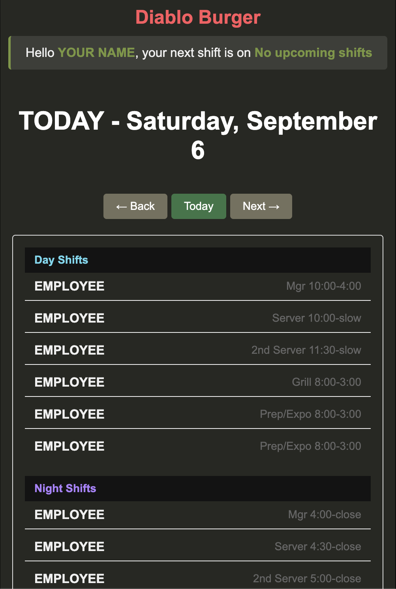
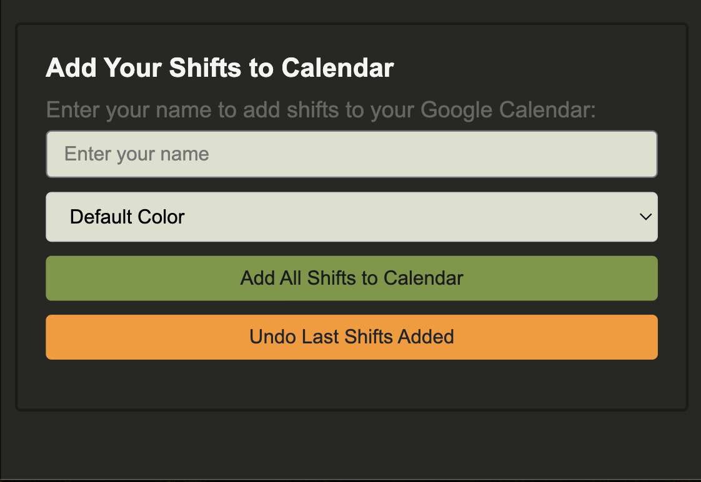

# Custom Restaurant Schedule App

A lightweight web application designed to streamline restaurant scheduling by displaying day-to-day employee shifts and allowing quick integration with Google Calendar.

# Features

### Daily Shift Viewer
Displays scheduled shifts and assigned employees for each day.

### Google Sheets Integration
Reads shift data directly from a pre-existing Google Spreadsheet.

### Google Calendar Export
Allows employees to automatically generate Google Calendar events for their assigned shifts.

### Tech Stack

Backend: Node.js, Express

Frontend: Vanilla JavaScript, HTML, CSS

APIs: Google Sheets API, Google Calendar API

Authentication: OAuth 2.0 (Google)

